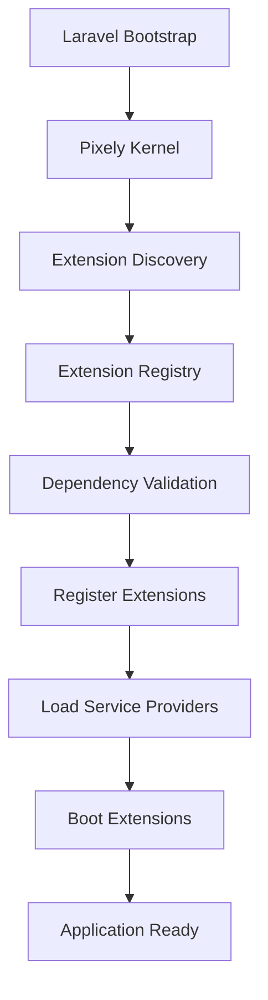

# Boot Process Diagram

```mermaid
flowchart TD

A[Laravel Bootstrap]
--> B[Pixely Kernel]

B --> C[Extension Discovery]
C --> D[Extension Registry]
D --> E[Dependency Validation]
E --> F[Register Extensions]
F --> G[Load Service Providers]
G --> H[Boot Extensions]
H --> I[Application Ready]
```