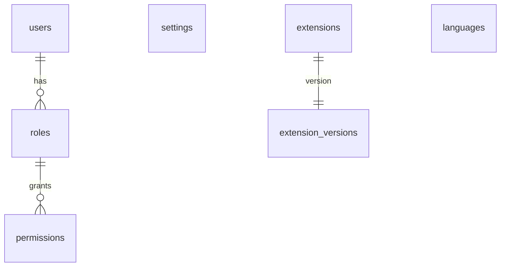

# Platform Data Model

```mermaid
erDiagram

users
roles
permissions
settings
extensions
extension_versions
languages

users ||--o{ roles : has
roles ||--o{ permissions : grants
extensions ||--|| extension_versions : version
```